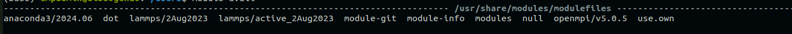

# راهنمای استفاده از HPC

**گروه ماده چگال دانشگاه تربیت مدرس**  

## مقدمه
این راهنما به شما کمک می‌کند تا بتوانید از سیستم **محاسباتی گروه ماده چگال تربیت مدرس** بهره ببرید و بتوانید کد و برنامه‌های خود را به اجرا بگذارید. بطور کلی به صورت استاندارد سیستم‌های HPC برای تقسیم منابع محاسباتی به کاربران از سیستم‌های مدیریت منابع در محیط HPC استفاده می‌کنند. یکی از این سیستم‌ها SLURM می‌باشد که در اینجا کار با آن را یاد خواهیم گرفت.

### نکات مهم قبل از شروع به کار:
1. برای نصب هر گونه نرم افزار در سیستم می‌بایست با مسئول HPC تماس گرفته شود.
2. بطور کلی سیستم‌های HPC برای اجرای زمان‌بر و سنگین می‌باشند و نباید برای عیب‌یابی کد خود استفاده کنید.
3. کاربران دسترسی root ندارند.
4. سیستم‌های HPC دسترسی به اینترنت ندارند.
5. برای اجرای سریع کد همواره بیشترین منابع کمک‌کننده نمی‌باشد و می‌بایست مقدارهای بهینه سیستم خود را بیابید.
6. چنانچه کد خارج اختیارات خود اجرا کنید به طور خودکار برای ادمین پیام ارسال خواهد شد.
7. به هر کاربر منابع محدودی تخصیص داده می‌شود. طبیعی است چنانچه بیشتر از آن حد درخواست شود سیستم اجرا نخواهد شد.
8. سرورهای محاسباتی عموماً برای کارهای موازی ساخته شده‌اند. چنانچه کد شما موازی نوشته نشده باشد طبیعی است که بهره کمتری از آن خواهید برد.

---

## ورود به سیستم (Login)
برای ورود به سیستم:
1. یک شبیه‌ساز ترمینال مانند PuTTY یا Terminal باز کنید.
2. دستور زیر را اجرا کنید:
```bash
   ssh username@hpc_server_address
```
3. رمز عبور خود را وارد کنید.
4. در صورت نیاز به استفاده از احراز هویت دو مرحله‌ای، دستورالعمل‌های ارائه‌شده را دنبال کنید.

توجه: `username` و `hpc_server_address` هنگام ثبت‌نام در اختیارتان قرار خواهد گرفت.

# مدیریت ماژول‌ها در اوبونتو
از آنجاییکه که فضای HPC یک فضای مشترک است و با توجه به نیازهای متعدد کاربران از پکیج‌های نرم‌افزاری برای مدیریت نرم‌افزارها در محیط HPC از سیستم ماژول‌ها استفاده می‌شود. در این سیستم از میان ماژول‌های (نرم‌افزار، کتابخانه یا پکیج) موجود می‌توان آن‌هایی که مورد نیاز است را load کنید. بنابراین چنانچه نیاز به نرم‌افزاری دارید و در لیست وجود داشت می‌بایست load کنید چون قبل از load کردن سیستم از وجود آن اطلاعی نخواهد داشت.
دستورات زیر برای کار با ماژول‌ها مفید هستند:

نمایش ماژول‌های موجود:

```bash 
module avail
```



این دستور لیستی از ماژول‌های نرم‌افزاری موجود را نمایش می‌دهد.

بارگذاری یک ماژول:

```bash 
module load module_name
```


`module_name` را با نام ماژول مورد نظر جایگزین کنید.

لغو بارگذاری یک ماژول:

```bash
module unload module_name

```


`module_name` را با نام ماژول مورد نظر جایگزین کنید.

نمایش ماژول‌های بارگذاری‌شده:

```bash
module list
```

این دستور لیستی از ماژول‌های فعال را نمایش می‌دهد.

# دستورات اصلی SLURM

برای شروع بدانید که سیستمی مانند SLURM هدفش قرار دادن اجرای شما در صف میان دیگر کاربران است. برای همین مانند هر صف دیگر با تعیین نیازهای واقعی خود از جمله زمان مورد نیاز اجرا، منابع محاسباتی مناسب می‌توانید در شروع اجرا تسریع داشته باشید.

در سیستم SLURM عموما می‌بایست کار job خود در قالب یک فایل ثبت کنید تا در صف قرار بگیرد.

SLURM دستورات متعددی برای مدیریت کارها دارد. برخی از این دستورات عبارتند از:


مشاهده وضعیت گره‌ها:

```bash
sinfo
```

این دستور اطلاعاتی در مورد گره‌های موجود در سیستم نمایش می‌دهد.

مشاهده وضعیت کارها:

```bash
squeue

```
این دستور وضعیت کارهای ارسال‌شده را نمایش می‌دهد (می‌توانید id کار خود را ببینید).


لغو یک کار:

```bash
scancel job_id

```
job_id این id کار شماست.

## ساخت اسکریپت کار
یک فایل اسکریپت نمونه:

```bash
#!/bin/bash
#SBATCH --job-name=test_job
#SBATCH --output=output.txt
#SBATCH --error=error.txt
#SBATCH --ntasks=1
#SBATCH --time=01:00:00
#SBATCH --partition=standard

module load python
python script.py
```

توضیح اسکریپت

- #SBATCH --job-name: نام کار
- #SBATCH --output: مسیر فایل خروجی
- #SBATCH --error: مسیر فایل خطاها
- #SBATCH --ntasks: تعداد پردازش‌ها
- #SBATCH --time: زمان اجرا (ساعت:دقیقه:ثانیه)
- #SBATCH --partition: بخش مورد نظر

نکات مهم


- همیشه از تنظیمات صحیح برای اسکریپت‌های خود اطمینان حاصل کنید.
- قبل از ارسال کارها، وضعیت گره‌ها را بررسی کنید.
- از فضای ذخیره‌سازی به صورت بهینه استفاده کنید.
- پس از اتمام کارها، فایل‌های خروجی را بررسی کنید.

## منابع بیشتر
برای اطلاعات بیشتر به مستندات رسمی SLURM مراجعه کنید:

```bash
https://slurm.schedmd.com/documentation.html

```

## پکیج‌های موجود

- anaconda3/2024.06 
- julia/1.11.0
- lammps/2Aug2023
- lammps/active_2Aug2023
- openmpi/v5.0.5
- julia/1.11.0
- scalapack/2.2.0
- boost/1.83.0
- mpich/4.1.2
- vasp/6.4.2     
- espressomd/4.2.2 
- openblas/0.3.27  
- fftw/3.3.10
